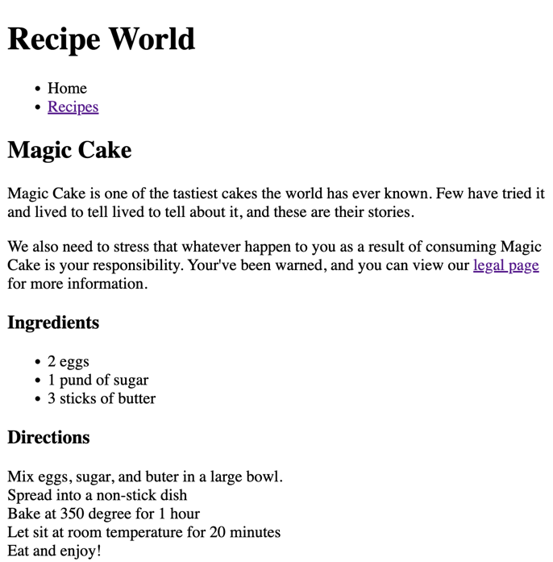
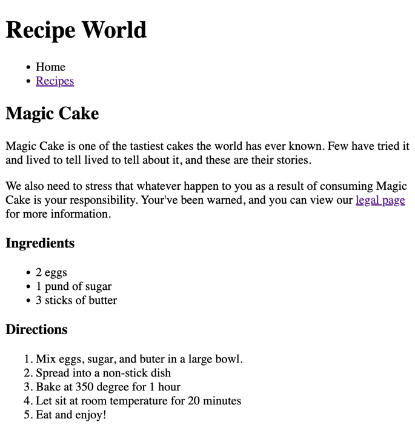

## [Home](../../../README.md) > [Back](../lesson.md) > Homework #1

### Decorate the Recpie Website with using HTML tags

### Your tasks:

1. Open the [index.html](index.html) file and follow the instructions below to decorate using HTML tags, the final output will be shown below:
       
   - All headers will be marked as heading tags, higher heading numbers mean the content between the headings is less important than lower numbers
         
   - Add paragraph content (where necessary) in between heading tags.
   - Use an unordered list to display a list of things
         
   - Use an ordered list to show list items in a certain order
         
   - Don't forget to delete ` ` tags from the old style code
