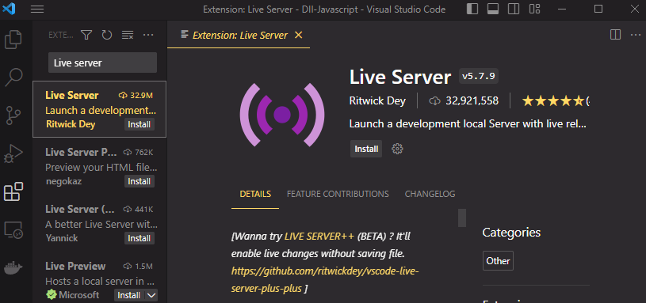
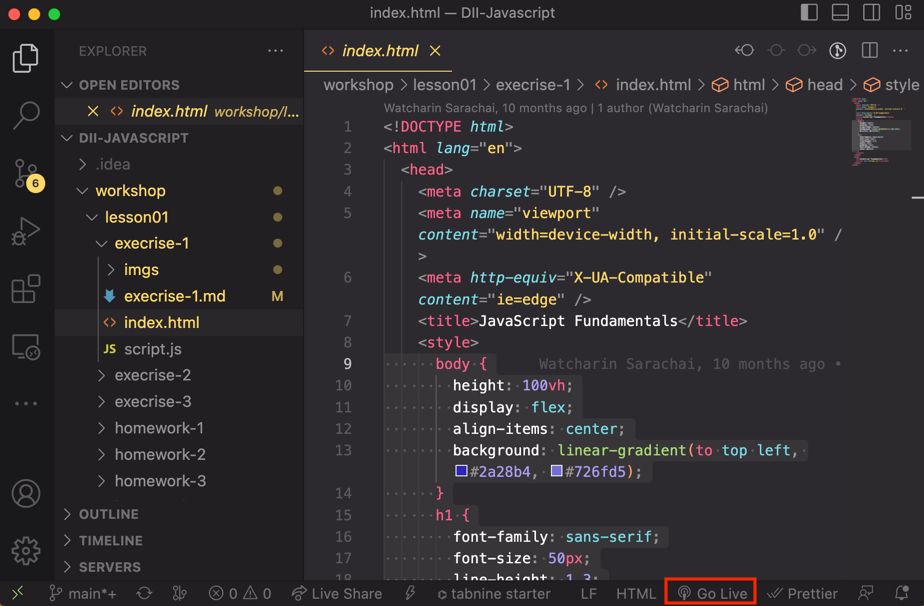

## [Home](../../../README.md) > [Back](../lesson.md) > Coding Execrise #1

### Your tasks:
1. Install `Live server` extension.
    - Select the extension tab and type `Live server` in the search box as shown below:
        
    - Click `Install` button.
2. Open the [index.html](index.html) file and clicks on the "" button to start the Live-Server.
   
3. Select the `Customize and control Google Chrome` (The three dot on the top right )"View->Developer->Inspect Elements" of Chrome browser and click on the "console" tab.
4. Follow the instructions in the slide.
