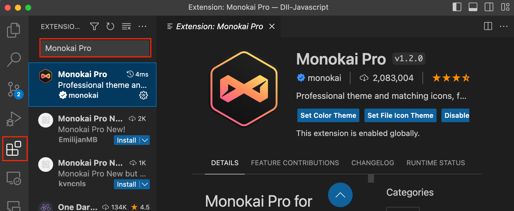
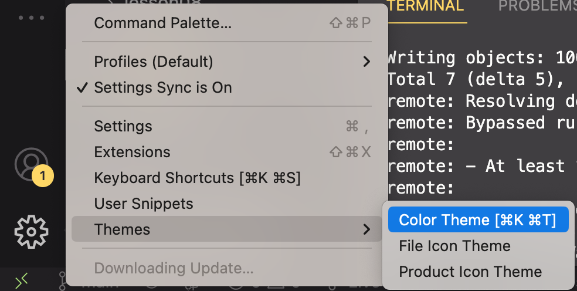
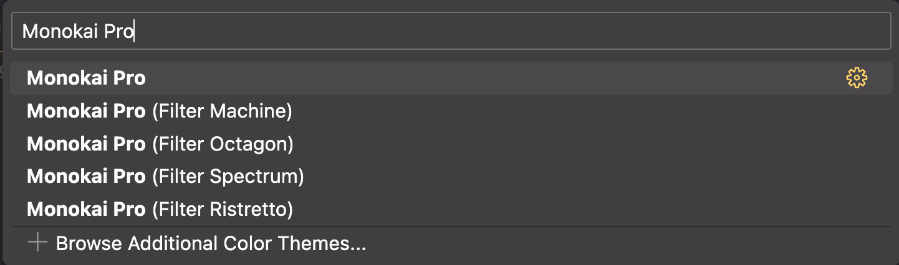

## [Home](../../../README.md) > [Back](readme.md) > VSCode Installation

### Your tasks:

1. Goto [Visual Studio downlaod](https://code.visualstudio.com/download)
2. Download the installation file depending on your operating system.
3. After the installation is completed, run and execute the program.
       
4. Selecting the theme

   - Install `Monokai Pro` theme:
         

   - Click the gear icon () on the left bottom corner and select `Color Theme` or `Themes->Color Theme`.
         
   - Then select the `Monokai Pro` theme:
         
