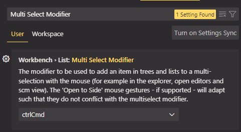

## [Home](../../../../README.md) > [Back](../readme.md) > VSCode Installation and Settings

### Your tasks:

1.  Download and install Google Chrome browser:
    - Goto [Chrome download page](https://www.google.com/intl/en_sg/chrome/)
2.  Download and install Vistual Studio Code:
    - Goto [Visual Studio downlaod](https://code.visualstudio.com/download)
    - Download the installation file depending on your operating system.
    - After the installation is completed, run and execute the program.
          
3.  Selecting the VSCode theme
    - Install `Monokai Pro` theme by seleting the extension tab and type `Monokai Pro` as shown below:
          
    - Click `Install` button.
    - Change the theme to `Monokai Pro`
      - Click the gear icon () on the left bottom corner and select `Themes->Color Theme`.
            
      - Then select the `Monokai Pro` theme:
            
4.  Auto save settings of the VSCode
    - Click the gear icon () on the left bottom corner and select `Settings`.
          
    - Type `Auto Save` in the search box and then select `OnFocusChange` in the select list of the `File: Auto Save` section.
          
5.  Multi select modifier settings of the VSCode
    - Click the gear icon () on the left bottom corner and select `Settings`.
    - Type `Multi Select Modifier` in the search box and then confirm it is `ctrlCmd` in the select list otherwise change it back to `ctrlCmd`.
          
6.  Format on save settings of the VSCode
    - Install `Prettier - Code formatter` extension by seleting the extension tab and type `Prettier` as shown below:
          
    - Click `Install` button.
    - Click the gear icon () on the left bottom corner and select `Settings`.
    - Type `format on save` in the search box and then check the checkbox in the `Editor: Format On Save` section as shown below:
          
7.  File icon and theme settings of the VSCode
    - Click the gear icon () on the left bottom corner and select `Themes->File Icon Theme`.
          
    - Type the `Seti` in the search box and select `Seti (Visual Studio Code)`:
          
