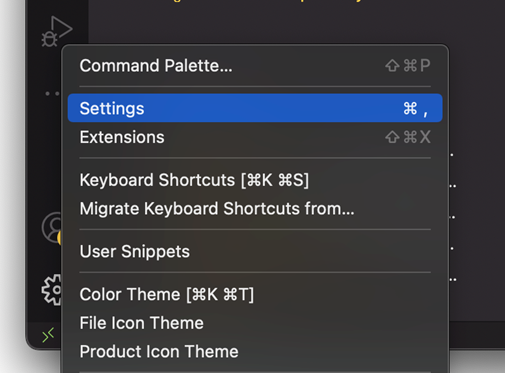
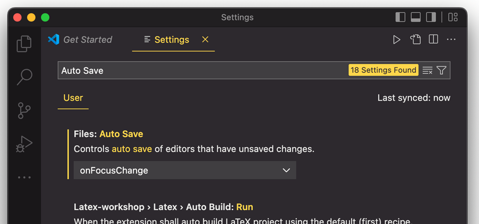
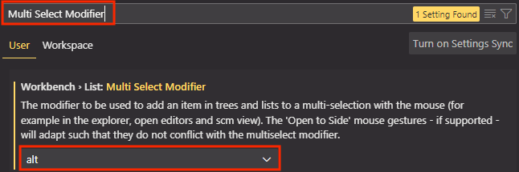

## [Home](../../../README.md) > [Back](../lesson.md) > VSCode Settings

### Your tasks:

1. Click the gear icon () on the left bottom corner and select `Settings`.
       

   - Type `Auto Save` and then select `OnFocusChange` in the select list of the `Fild: Auto Save` section.
         

2. Multi select modifier settings of the VSCode
   - Click the gear icon () on the left bottom corner and select `Settings`.
   - Type `Multi Select Modifier` and then select `Alt` in the select list of the `Fild: Auto Save` section.
         
