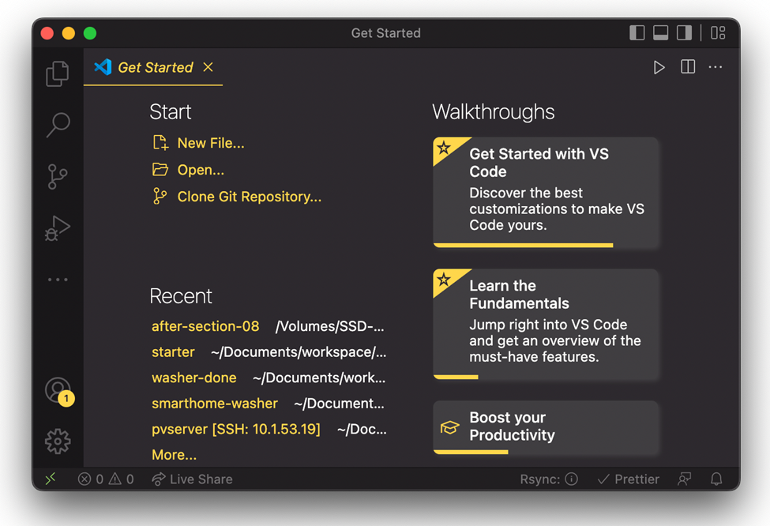

## [Home](../../../README.md) > [Back](../lesson.md) > Installation

### Your tasks:

#### VSCode Installation

1. Goto [Visual Studio downlaod](https://code.visualstudio.com/download)
2. Download the installation file depending on your operating system.
3. After the installation is completed, run and execute the program.

   

4. Selecting the theme

   - Install `Monokai Pro` theme:

     

  - Click the gear icon () on the left bottom corner and select `Color Theme` or `Themes->Color Theme`.

    

  - Then select the theme you like, for example:

     
