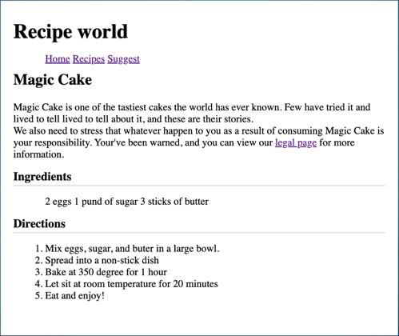

## [Home](../../../README.md) > [Back](../lesson.md) > Homework #1

### Your tasks:

1. Follow the instructions in the slide `02-1-Website-development-with-HTML-CSS` and use HTML and CSS tags to create the Recpie Website.
2. The final output will be shown below:

