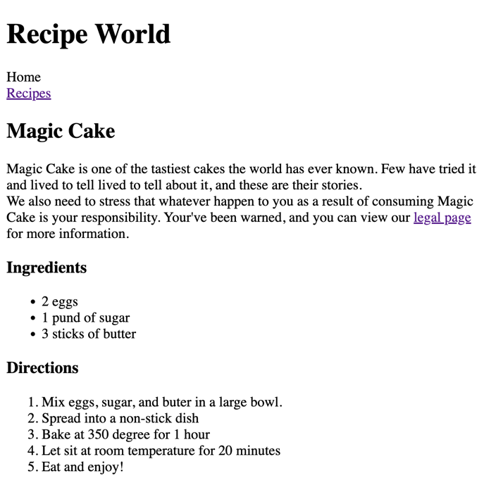

## [Home](../../../README.md) > [Back](../lesson.md) > Execrise #1

### Gassing number game

### Your tasks:

1. Implement the real Guess the Number Game.
   <br/><br/><br/><br/>

   - Init the variables and the secret number
     ```
     let secretNumber = Math.trunc(Math.random() * 20) + 1;
     let score = 20;
     let highscore = 0;
     ```
   - Create the `displayMessage` function

     ```
     const displayMessage = function (message) {
       document.querySelector('.message').textContent = message;
     };
     ```

   - Add the `click` listener to the `check!` button to Check the correct number.

     ```
     document.querySelector('.check').addEventListener('click', function () {
       // Insert code here

     });
     ```

     - Inside the listener function, insert the code below:

       - Retrieve the guess number from the HTML input element that has `.guess` class.
         ```
         const guess = Number(document.querySelector('.guess').value);
         console.log(guess, typeof guess);
         ```
       - When the user click the `Check!` button, write the code to check the guess number:

         ```
           if (!guess) {
             // When there is no input

           } else if (guess === secretNumber) {
             // When player wins

           } else if (guess !== secretNumber) {
             // When guess is wrong

           }
         ```

         - From the previous `if-else` code, in case, when there is no input:

           ```
           displayMessage('⛔️ No number!');
           ```

         - From the previous `if-else` code, when player wins:

           ```
           displayMessage('🎉 Correct Number!');
           document.querySelector('.number').textContent = secretNumber;

           document.querySelector('body').style.backgroundColor = '#60b347';
           document.querySelector('.number').style.width = '30rem';

           if (score > highscore) {
             highscore = score;
             document.querySelector('.highscore').textContent = highscore;
           }
           ```

         - From the previous `if-else` code, when guess is wrong:
           ```
           if (score > 1) {
             displayMessage(guess > secretNumber ? '📈 Too high!' : '📉 Too low!');
             score--;
             document.querySelector('.score').textContent = score;
           } else {
             displayMessage('💥 You lost the game!');
             document.querySelector('.score').textContent = 0;
           }
           ```

2. Coding Challenge
   - Implement a game rest functionality, so that the player can make a new guess! Here is how:
     - Select the element with the 'again' class and attach a click event handler
     - In the handler function, restore initial values of the score and secretNumber variables
     - Restore the initial conditions of the message, number, score and guess input field
     - Also restore the original background color (#222) and number width (15rem)

GOOD LUCK 😀
