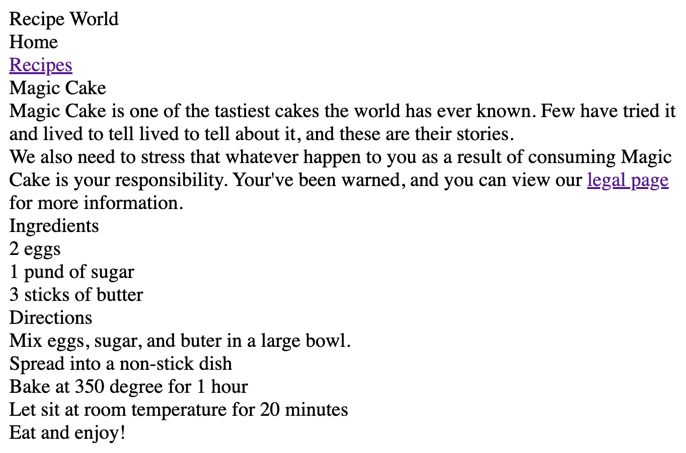
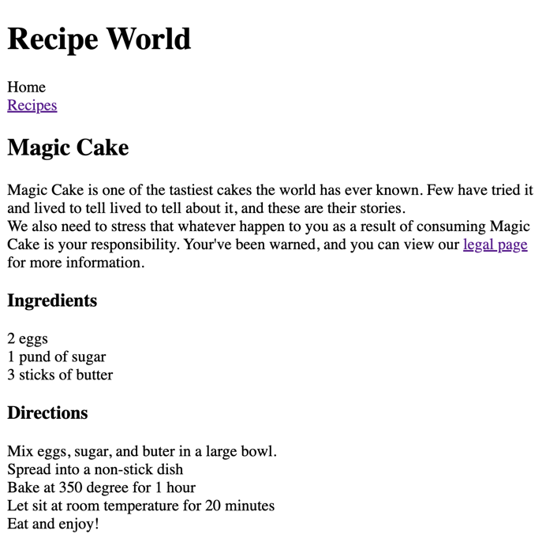
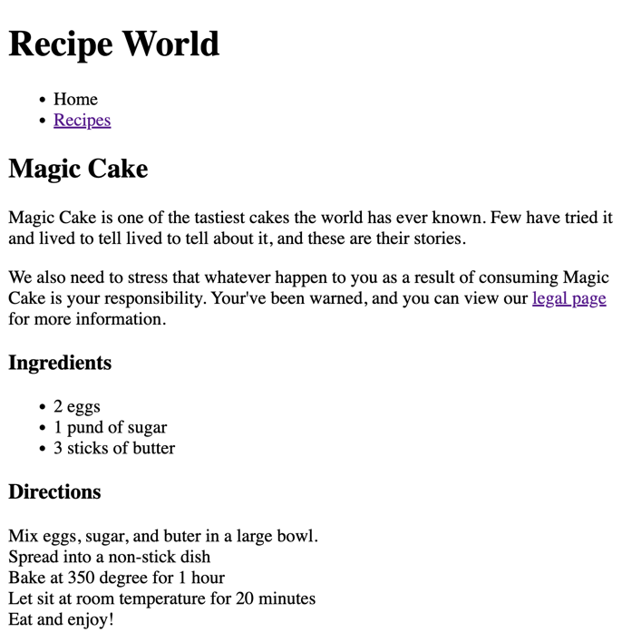
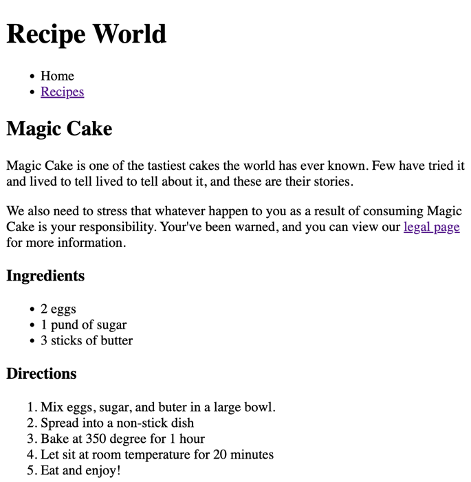
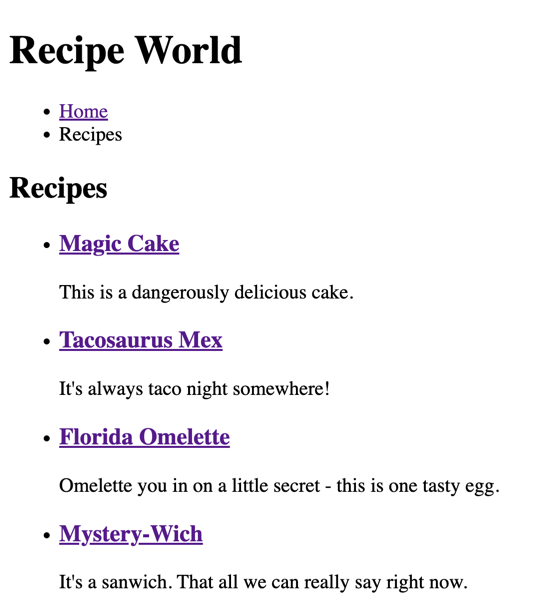
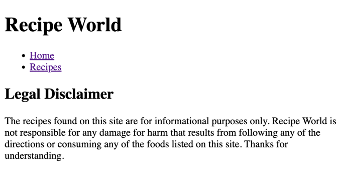

## [Home](../../../README.md) > [Back](../lesson.md) > Execrise #1

### Decorate the Recpie Website with using HTML tags

### Your tasks:

1. Open the [index.html](index.html) file and clicks on the  button at the status bar to start the Live-Server.
2. Follow the instructions below to decorate using HTML tags:
   1. The output before modifying as shown below:
          
   2. All headers will be marked as heading tags, higher heading numbers mean the content between the headings is less important than lower numbers
          
   3. Add paragraph content (where necessary) in between heading tags.
   4. Use an unordered list to display a list of things
          
   5. Use an ordered list to show list items in a certain order
          
   6. Don't forget to delete ` ` tags from the old style code
3. Do the same thing for the another [recipes.html](recipes.html) file
       
4. Do the same thing for the another [legal.html](legal.html) file
       
