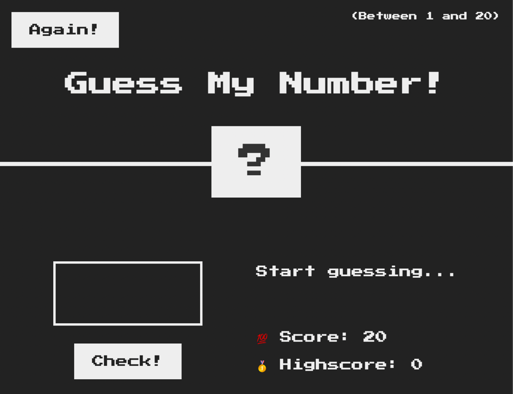

## [Home](../../../README.md) > [Back](../lesson.md) > Homework #2: Pig Game

### Your tasks:

### Implement the Pig game.

<br/><br/><br/>
<br/><br/><br/><br/>

1. Write the code to select the necessary elements

   ```
   const player0El = document.querySelector('.player--0');
   const player1El = document.querySelector('.player--1');
   const score0El = document.querySelector('#score--0');
   const score1El = document.getElementById('score--1');
   const current0El = document.getElementById('current--0');
   const current1El = document.getElementById('current--1');

   const diceEl = document.querySelector('.dice');
   const btnNew = document.querySelector('.btn--new');
   const btnRoll = document.querySelector('.btn--roll');
   const btnHold = document.querySelector('.btn--hold');
   ```

2. Declare the global variables

   ```
   let scores, currentScore, activePlayer, playing;
   ```

3. Append the `.hidden` class to the [style.css](style.css) file
   ```
   .hidden {
     display: none;
   }
   ```
4. Init all variables with these code below:

   ```
   scores = [0, 0];
   currentScore = 0;
   activePlayer = 0;
   playing = true;

   score0El.textContent = 0;
   score1El.textContent = 0;
   current0El.textContent = 0;
   current1El.textContent = 0;

   diceEl.classList.add('hidden');
   player0El.classList.remove('player--winner');
   player1El.classList.remove('player--winner');
   player0El.classList.add('player--active');
   player1El.classList.remove('player--active');
   ```

5. Implement the `switchPlayer` function for switching the current player
   ```
   const switchPlayer = function () {
     document.getElementById(`current--${activePlayer}`).textContent = 0;
     currentScore = 0;
     activePlayer = activePlayer === 0 ? 1 : 0;
     player0El.classList.toggle('player--active');
     player1El.classList.toggle('player--active');
   };
   ```
6. Implement the rolling dice functionality

   - Add the event handler `click` to the `btnRoll` button

     ```
     btnRoll.addEventListener('click', function () {
       if (playing) {
         // 1. Generating a random dice roll

         // 2. Display dice

         // 3. Check for rolled 1

       }
     });
     ```

7. Hold button implementation

   - Add the event handler `click` to the `btnHold` button

     ```
     btnHold.addEventListener('click', function () {
       if (playing) {
         // 1. Add current score to active player's score

         // 2. Check if player's score is >= 100

       }
     });
     ```

8. Test the game

9. Coding Challenge: implement a game rest functionality, so that the player can restart the conditions, here is how:

   - Define the `init` function to call whenever the game needs to init all conditions
   - Move all init code as shown below to the `init` function and call the `init` function instead:

     ```
     scores = [0, 0];
     currentScore = 0;
     activePlayer = 0;
     playing = true;

     score0El.textContent = 0;
     score1El.textContent = 0;
     current0El.textContent = 0;
     current1El.textContent = 0;

     diceEl.classList.add('hidden');
     player0El.classList.remove('player--winner');
     player1El.classList.remove('player--winner');
     player0El.classList.add('player--active');
     player1El.classList.remove('player--active');
     ```

   - The game can restart again by clicking the `🔄 New game` button, so, add the event handler `click` to the `btnNew` button to call the `init` function
     ```
     btnNew.addEventListener('click', init);
     ```

GOOD LUCK 😀
