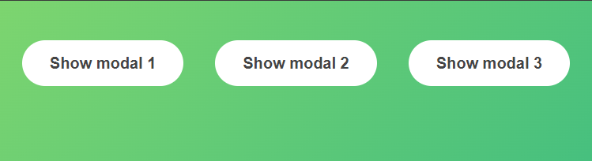

## [Home](../../../README.md) > [Back](../lesson.md) > Execrise #2

Implement a Modal Window
<br/><br/><br/><br/>

### Your tasks:

1. Query the elements
   ```
   const modal = document.querySelector(/* your code here */);
   const overlay = document.querySelector(/* your code here */);
   const btnCloseModal = document.querySelector(/* your code here */);
   // Select all three ".show-modal" elements, the result will an array of elements
   const btnsOpenModal = document.querySelectorAll(/* your code here */);
   ```
2. Define the `openModal` function
   ```
   const openModal = function () {
     modal.classList.remove('hidden');
     overlay.classList.remove('hidden');
   };
   ```
3. Define the `closeModal` function
   ```
   const closeModal = function () {
     modal.classList.add('hidden');
     overlay.classList.add('hidden');
   };
   ```
4. Add the event handler "click" to the `".show-modal"` button to make the Modal dialog appear.
   ```
   for (let i = 0; i < btnsOpenModal.length; i++) {
     btnsOpenModal[i].addEventListener('click', openModal);
   }
   ```
5. We need to close the modal, there are three ways to close the modal. Implement all these methods as shown below:
   - When the user click the `".close-modal"` button
     ```
     btnCloseModal.addEventListener('click', closeModal);
     ```
   - When the user click mouse outside the modal
     ```
     overlay.addEventListener('click', closeModal);
     ```
   - When the user presses the Escape key
     ```
     document.addEventListener('keydown', function (e) {
       if (e.key === 'Escape' && !modal.classList.contains('hidden')) {
         closeModal();
       }
     });
     ```
