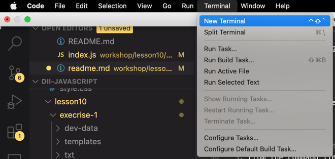

## [Home](../../../README.md) > [Back](../lesson.md) > Exercise #1

### Your tasks:

#### According to the slide of lesson10, create the simple web

1. Open [index.js](../index.js) file and write the code below:

   ```
   'use strict';

   const fs = require('fs');
   const http = require('http');

   const server = http.createServer((req, res) => {
     const pathName = req.url;
     if (pathName === '/' || pathName === '/overview') {
       res.end('This is the OVERVIEW');
     } else if (pathName === '/product') {
       res.end('This is the PRODUCT');
     } else if (pathName === '/api') {
       fs.readFile(`${__dirname}/dev-data/data.json`, 'utf-8', (err, data) => {
         console.log(data);
         res.writeHead(200, {
           'Content-Type': 'application/json',
         });
         res.end(data);
       });
     } else {
       res.writeHead(404, {
         'Content-Type': 'text/html',
         'my-own-header': 'hello world!',
       });
       res.end('<h1>Page not found</h1>');
     }
   });

   server.listen(8000, '127.0.0.1', () => {
     console.log('Listening to requests on port 8000');
   });
   ```

2. In the VSCode, open the terminal
   <br/><br/><br/><br/>
3. From the command line: change to the directory `workshop/lesson10/exercise-1` and run the following command:

   ```
   node index.js
   ```

   <br/><br/><br/>

4. Open the browser and navigate to the URL as specified below:
   - `http://127.0.0.1:8000/` or `http://localhost:8000/overview`
   - `http://localhost:8000/product`
   - `http://127.0.0.1:8000/api`
   - `http://127.0.0.1:8000/xxx`
5. Modify the code to improve performance

   ```
   'use strict';

   const fs = require('fs');
   const http = require('http');

   const data = fs.readFileSync(`${__dirname}/dev-data/data.json`, 'utf-8');
   const dataObject = JSON.parse(data);

   const server = http.createServer((req, res) => {
     const pathName = req.url;
     if (pathName === '/' || pathName === '/overview') {
       res.end('This is the OVERVIEW');
     } else if (pathName === '/product') {
       res.end('This is the PRODUCT');
     } else if (pathName === '/api') {
       res.writeHead(200, {
         'Content-Type': 'application/json',
       });
       res.end(data);
     } else {
       res.writeHead(404, {
         'Content-Type': 'text/html',
         'my-own-header': 'hello world!',
       });
       res.end('<h1>Page not found</h1>');
     }
   });

   server.listen(8000, '127.0.0.1', () => {
     console.log('Listening to requests on port 8000');
   });
   ```

6. Copy and rename the file from `exercise-1/templates/overview.html` to `exercise-1/template-overview.html`
7. Create the new file `exercise-1/template-card.html` and copy only a one of HTML fragment `<figure ..>..</figure>` from the `exercise-1/template-overview.html` to `exercise-1/template-card.html`

   ```
   ...
   <figure class="card">
      <div class="card__emoji">🥑🥑</div>

      <div class="card__title-box">
      <h2 class="card__title">Fresh Avocado</h2>
      </div>

      <div class="card__details">
      <div class="card__detail-box">
         <h6 class="card__detail card__detail--organic">Organic!</h6>
      </div>

      <div class="card__detail-box">
         <h6 class="card__detail">4 🥑 per 📦</h6>
      </div>

      <div class="card__detail-box">
         <h6 class="card__detail card__detail--price">6.50€</h6>
      </div>
      </div>

      <a class="card__link" href="#">
      <span>Detail <i class="emoji-right">👉</i></span>
      </a>
   </figure>
   ...
   ```

8. Replace the HTML element with our template
   - For every image (🥑 for example), replace with the `` template
   - In the `<h2 class="card__title">Fresh Avocado</h2>` replace the title with the `` template.
     ```
     ...
     <h2 class="card__title"></h2>
     ...
     ```
   - For the quentity replace with `<h6 class="card__detail">  per 📦</h6>`
   - For the price replace with `<h6 class="card__detail card__detail--price">€</h6>`
   - For the product detail link replace with `<a class="card__link" href="/product?id=">`
   - For the organic detail replace with the following code:
     ```
     ...
     <div class="card__detail-box ">
       <h6 class="card__detail card__detail--organic">Organic!</h6>
     </div>
     ...
     ```
9. Open the [template-overview.html](template-overview.html) file searching for the the HTML fragment `<figure ..>..</figure>`:
   ```
   ...
   <div class="cards-container">
      <figure class="card">
        ...
      </figure>
      <figure class="card">
        ...
      </figure>
      <figure class="card">
        ...
      </figure>
      <figure class="card">
        ...
      </figure>
      <figure class="card">
        ...
      </figure>
   </div>
   ```
   and replace with the following code:
   ```
   <div class="cards-container"></div>
   ```
10. Copy and rename the file from `exercise-1/templates/product.html` to `exercise-1/template-product.html` and replace the template into the HTML element with our custom template as shown below:
    <br/><br/><br/><br/>
11. We load all templates (tempOverview, tempProduct, and tempCard) in a global environment, inserting the following code into the beginning section of the [index.js](index.js) file

    ```
    'use strict';

    const fs = require('fs');
    const http = require('http');
    const path = require('path');

    const tempOverview = fs.readFileSync(
      path.join(__dirname, 'template-overview.html'),
      'utf8'
    );
    const tempProduct = fs.readFileSync(
      path.join(__dirname, 'template-product.html'),
      'utf8'
    );
    const tempCard = fs.readFileSync(
      path.join(__dirname, 'template-card.html'),
      'utf8'
    );

    const data = fs.readFileSync(`${__dirname}/dev-data/data.json`, 'utf-8');
    const dataObject = JSON.parse(data);

    ...
    ```

12. Create the `replaceTemplate` function at the beginning of the the [index.js](index.js) file. All code is placed our custom template with the product object

    ```
    ...
    const replaceTemplate = (temp, product) => {
      let output = temp.replace(//g, product.productName);
      output = output.replace(//g, product.image);
      output = output.replace(//g, product.price);
      output = output.replace(//g, product.from);
      output = output.replace(//g, product.nutrients);
      output = output.replace(//g, product.quantity);
      output = output.replace(//g, product.description);
      output = output.replace(//g, product.id);

      if (!product.organic) {
        output = output.replace(//g, 'not-organic');
      }
      return output;
    };

    const server = http.createServer((req, res) => {
      ...
    });

    ...
    ```

13. Call the `replaceTemplates` function by replacing the code flagment with the code as shown below:
    ```
    ...
    const server = http.createServer((req, res) => {
      const pathName = req.url;
      if (pathName === '/' || pathName === '/overview') {
        res.end('This is the OVERVIEW');
      } else if (pathName === '/product') {
        res.end('This is the PRODUCT');
      } else if ...
    ```
    to
    ```
    ...
    const server = http.createServer((req, res) => {
      const pathName = req.url;
      if (pathName === '/' || pathName === '/overview') {
        res.writeHead(200, {
          'Content-Type': 'text/html',
        });
        const cardsHtml = dataObject
          .map(el => replaceTemplate(tempCard, el))
          .join('');
        const outputHtml = tempOverview.replace('', cardsHtml);
        res.end(outputHtml);
      } else if (pathName === '/product') {
        res.end('This is the PRODUCT');
      } else if ...
    ```
14. From the command line: stop the node application and start the application again by running the following command:

    - Press `Ctrl-c` to stop the node application
    - Type the following to start the node application
      ```
      node index.js
      ```

15. Open the browser and navigate to the URL as specified below:

    - `http://127.0.0.1:8000/` or `http://localhost:8000/overview`

16. Parsing Variables From URLs
    - Include the URL module, use the require() method: `const url = require('url');`
17. Edit the code to handle the `/product?id=`

    - Replace the code `const pathName = req.url;` with the `const { query, pathname } = url.parse(req.url, true);`
    - In the `/product` route, replace the existing code with the following code below:

      ```
      ...
      } else if (pathName === '/product') {
        res.end('This is the PRODUCT');
      }
      ...
      ```

      to

      ```
      ...
      } else if (pathname === '/product') {
        res.writeHead(200, {
          'Content-Type': 'text/html',
        });
        const product = dataObject[query.id];
        const output = replaceTemplate(tempProduct, product);
        res.end(output);
      }
      ...
      ```

18. Restart the node application and try to click the "DETAIL" link and the browser will navigate to the product detail page.
    <br/><br/><br/><br/>
    the product detail page example as shown below:
    <br/><br/><br/><br/>
19. Make the `replaceTemplate` as a JavaScript module

    - Create the `modules` directory in the same directory of the `index.js` file
    - Move the `replaceTemplate` function to the [./modules/replaceTemplate.js](modules/replaceTemplate.js)

      ```
      'use strict';

      const replaceTemplate = (temp, product) => {
        let output = temp.replace(//g, product.productName);
        output = output.replace(//g, product.image);
        output = output.replace(//g, product.price);
        output = output.replace(//g, product.from);
        output = output.replace(//g, product.nutrients);
        output = output.replace(//g, product.quantity);
        output = output.replace(//g, product.description);
        output = output.replace(//g, product.id);

        if (!product.organic) {
          output = output.replace(//g, 'not-organic');
        }
        return output;
      };
      ```

    - Update the code in [./modules/replaceTemplate.js](modules/replaceTemplate.js) file with the following code:

      ```
      'use strict';

      module.exports = (temp, product) => {
        let output = temp.replace(//g, product.productName);
        ...
      ```

    - Insert the following code at the beginning of the [index.js](index.js) file

      ```
      'use strict';

      const fs = require('fs');
      const http = require('http');
      const path = require('path');
      const url = require('url');
      const replaceTemplate = require('./modules/replaceTemplate');
      ...
      ```

20. Restart the node application
21. Finish.
