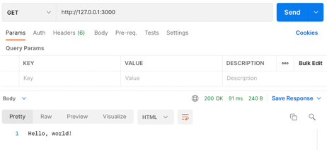
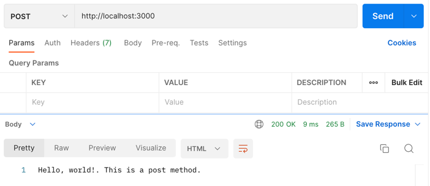

## [Home](../../../README.md) > [Back](../lesson.md) > Exercise #1

### Your tasks:

#### Setting up Express and Basic Routing

1. Open the terminal and change the current directory to `./lesson11/exercise-1`
2. Init the node package by typing:

   ```
   > npm init
   ```

   - Type the package name: `package name: (exercise-1) natours`
   - And the other options leave it as the default by pressing the `enter` key as shown below:
     ```
     Press ^C at any time to quit.
     package name: (exercise-1) natours
     version: (1.0.0)
     description:
     entry point: (index.js)
     test command:
     git repository:
     keywords:
     author:
     license: (ISC)
     About to write to /Users/watcharinsarachai/Documents/workspace/javascript/DII-Javascript workshop/lesson11/test/package.json:
     {
       "name": "natours",
       "version": "1.0.0",
       "description": "",
       "main": "index.js",
       "scripts": {
         "test": "echo \"Error: no test specified\" && exit 1"
       },
       "author": "",
       "license": "ISC"
     }
     Is this OK? (yes)
     ```

3. Install Express module

   ```
   > npm i express@4
   ```

4. Create the new file `app.js` and write the code as shown below:

   ```
   'use strict';
   const express = require('express');

   const app = express();

   app.get('/', (req, res) => {
     res.status(200).send('Hello, world!');
   });

   app.post('/', (req, res) => {
     res.status(200).send('Hello, world!. This is a post method.');
   });

   const port = 3000;
   app.listen(port, () => {
     console.log(`listening on port ${port}...`);
   });
   ```

5. Run and test
   ```
   > node app.js
   ```
6. Open the postman and navigate to the URL as specified below:
   - GET method: `http://127.0.0.1:3000`
     <br/><br/><br/><br/>
   - POST method: `http://127.0.0.1:3000`
     <br/><br/><br/><br/>
7. Finish
