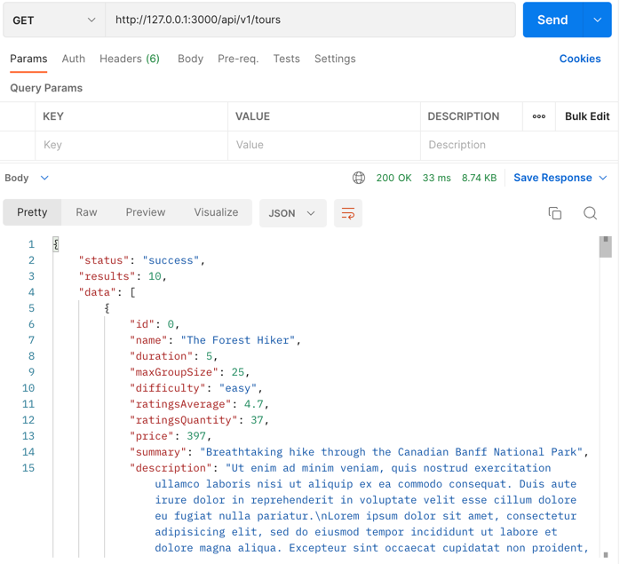
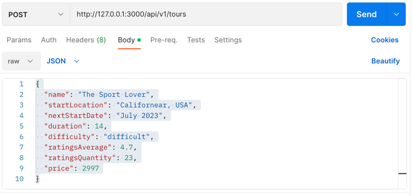
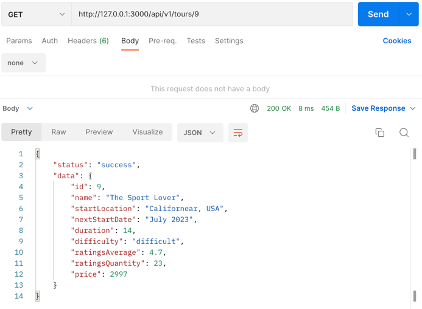

## [Home](../../../README.md) > [Back](../lesson.md) > Exercise #1

### Your tasks:

#### Create the natours web

1. According to the exercise-1: Init the node project in the `execrcise-2` directory

   - Run `> npm init`
   - Run `> npm i express@4`
   - Create the `app.js` file
   - Write the basic code for express application

     ```
     'use strict';
     const express = require('express');

     const app = express();

     app.get('/', (req, res) => {
       res.status(200).send('Hello, world');
     });

     const port = 3000;
     app.listen(port, () => {
       console.log(`listening on port ${port}...`);
     });
     ```

2. Return the JSON data from the `dev-data/data/tours-simple.json` file
   - Insert the required modules into the [appl.js](app.js) file
     ```
     ...
     const fs = require('fs');
     const path = require('path');
     ...
     ```
   - Load the global JSON data from the `dev-data/data/tours-simple.json`
     ```
     const jsonData = fs.readFileSync(
       path.join(__dirname, 'dev-data', 'tours-simple.json'),
       'utf-8'
     );
     const tours = JSON.parse(jsonData);
     ```
   - For the HTTP GET method
     - Create the route `/api/v1/tours` and return the JSON as the response
       `app.get('/api/v1/tours', (req, res) => { res.status(200).json({ status: 'success', results: tours.length, data: tours, }); });`
       <br/><br/><br/><br/>
3. Create the new tour data

   - We use the HTTP POST method to create the tour data
     - To get the data from a client, we must use a middleware. Adter the line of code `const app = express();` insert the code as shown below:
       ```
       ...
       const app = express();
       app.use(express.json()); // << insert this code
       ...
       ```
   - Create the POST route

     ```
     app.post('/api/v1/tours', (req, res) => {

     });
     ```

   - Get the new `tour` data and append it to the `tours` object by modifying the code in the previous step

     ```
     app.post('/api/v1/tours', (req, res) => {
       const newId = tours[tours.length - 1].id + 1;
       const newTour = Object.assign({id: newId}, req.body);
       tours.push(newTour);
     });
     ```

   - After inserted the `tour` object, save it back to the orignal `tours-simple.json` file

     ```
     app.post('/api/v1/tours', (req, res) => {
       const newId = tours[tours.length - 1].id + 1;
       const newTour = Object.assign({id: newId}, req.body);
       tours.push(newTour);

       fs.writeFile(
         path.join(__dirname, 'dev-data', 'tours-simple.json'),
         JSON.stringify(tours),
         err => {
           res.status(200).json({
             status: 'success',
             data: newTour,
           });
         }
       );
     });
     ```

4. Test insert a new tour data

   - Open the postman and use the POST method to send the data below to the POST route `/api/v1/tours`
     ```
     {
       "name": "The Sport Lover",
       "startLocation": "Californear, USA",
       "nextStartDate": "July 2023",
       "duration": 14,
       "difficulty": "difficult",
       "ratingsAverage": 4.7,
       "ratingsQuantity": 23,
       "price": 2997
     }
     ```
     <br/><br/><br/>
   - Click the `Send` button

5. Get the one tour by ID
   - Add GET route `/api/v1/tours/:id`
     ```
     app.get('/api/v1/tours/:id', (req, res) => {
       const id = Number.parseInt(req.params.id);
       const tour = tours.find(el => el.id === id);
       if (!tour) {
         return res.status(404).json({
           status: 'failed',
           message: 'Tour not found',
         });
       }
       res.status(200).json({
         status: 'success',
         data: tour,
       });
     });
     ```
   - Test get `tour.id = 9`
     <br/><br/><br/><br/>
6. Organize the Callback Function
   - Refactoring our routes by using the function
     ```
     ...
     app.get('/api/v1/tours', getAllTours);
     app.post('/api/v1/tours', createTour);
     app.get('/api/v1/tours/:id', getTour);
     ...
     ```
   - Test the web
   - Update the previous code to use `app.route()` to group it together
     ```
     ...
     app.route('/api/v1/tours/').get(getAllTours).post(createTour);
     app.route('/api/v1/tours/:id').get(getTour);
     ...
     ```
   - Test the web
7. Creating and Mounting Multiple Routes
   - Create route middleware.
     ```
     const tourRoute = express.Router();
     ```
   - Map tours route to it
     ```
     app.use('/api/v1/tours', tourRoute);
     ```
   - Modify the tours route to use the new Router object.
     ```
     tourRoute.route('/').get(getAllTours).post(createTour);
     tourRoute.route('/:id').get(getTour);
     ```
   - Test the web
8. Better Structure

   - Create the `tours` directory
   - Create the [tours/tourRoutes.js](tours/tourRoutes.js), and move all tour handler functions to it

     ```
     ...
     const getAllTours = (req, res) => { ... };
     const createTour = (req, res) => { ... };
     const getTour = (req, res) => { ... };
     ...
     ```

     tourRoutes.js

     ```
     'use strict';
     const express = require('express');
     const fs = require('fs');
     const path = require('path');

     const jsonData = fs.readFileSync(...);
     const tours = JSON.parse(jsonData);

     const tourRoute = express.Router();

     const getAllTours = (req, res) => { ... };
     const createTour = (req, res) => { ... };
     const getTour = (req, res) => { ... };

     tourRoute.route('/').get(getAllTours).post(createTour);
     tourRoute.route('/:id').get(getTour);

     module.exports = tourRoute;
     ```

     Don’t forget move the tours data to “tourRoutes.js”

   - Modify the [app.js](app.js) to use the `tourRoutes.js` module.

     ```
     'use strict';
     const express = require('express');
     const tourRoute = require('./tours/tourRoutes');

     const app = express();
     app.use(express.json());

     app.use('/api/v1/tours', tourRoute);

     const port = 3000;
     app.listen(port, () => {
       console.log(`listening on port ${port}...`);
     });
     ```

9. Better Structure, move all tour functions to the [tours/tourController.js](tours/tourController.js)

   ```
   'use strict';

   const fs = require('fs');
   const path = require('path');

   const jsonData = fs.readFileSync(...);
   const tours = JSON.parse(jsonData);

   exports.getAllTours = (req, res) => {...};
   exports.createTour = (req, res) => {...};
   exports.getTour = (req, res) => {...};
   ```

   tourRoutes.js

   ```
   'use strict';
   const express = require('express');
   const tourController = require('../controllers/tourController');

   const tourRoute = express.Router();

   tourRoute
     .route('/')
     .get(tourController.getAllTours)
     .post(tourController.createTour);
   tourRoute.route('/:id').get(tourController.getTour);

   module.exports = tourRoute;
   ```

10. Separate all server code from the route.

    - Create new file [server.js](server.js) and move this code from [app.js](app.js)

      ```
      'use strict';

      const port = 3000;
      app.listen(port, () => {
        console.log(`App listening on ${port}...`);
      });
      ```

    - Make the [app.js](app.js) as a module.

      ```
      'use strict';

      const express = require('express');
      const tourRoute = require('./tours/tourRoutes');

      const app = express();
      app.use(express.json());
      app.use('/api/v1/tours', tourRoute);

      module.exports = app;
      ```

    - Import the app module in the [server.js](server.js)

      ```
      'use strict';

      const app = require('./app');

      const port = 3000;
      app.listen(port, () => {
        console.log(`App listening on ${port}...`);
      });
      ```

    - Stop the running app and start the app by using this commnad:
      ```
      > node server.js
      ```

11. Run the Node App using `nodemon`
    - Install nodemon:
      ```
      > npm i --global nodemon
      ```
    - Run the node app
      ```
      > nodemon server.js
      ```
    - Or we can set this command in package.json
      ```
      {
        "name": "natours",
        "version": "1.0.0",
        "main": "index.js",
        "scripts": {
          "test": "echo \"Error: no test specified\" && exit 1",
          "start": "nodemon server.js"                             << Insert your code here
        },
        "author": "",
        "license": "ISC",
        "dependencies": {
          "express": "^4.18.2"
        },
        "description": ""
      }
      ```
    - Then, run this command:
      ```
      > npm start
      ```
12. Serving a Static Files

    - To serving a static files, add the code below to [app.js](app.js)

      ```
      app.use(express.static(`${__dirname}/public`));
      ```

    - Open browser and navigate to URL `http://127.0.0.1:3000/overview.html`

13. Environment Variables

    - Install the `dotenv`
      ```
      > npm i dotenv
      ```
    - Create new file [config.env](config.env) and create some variables

      ```
      NODE_ENV = development
      PORT = 3000
      ```

    - Then, require the `dotenv` module in the [server.js](server.js) file

      ```
      const dotenv = require('dotenv');
      ```

    - In the [server.js](server.js) file, loads environment variables from a [config.env](config.env) file into `process.env`

      ```
      dotenv.config({ path: './config.env' });
      ```

    - Config the port number from environment variable by editing the code in [server.js](server.js) as shown below:

      ```
      'use strict';
      const dotenv = require('dotenv');
      dotenv.config({ path: './config.env' });

      const app = require('./app');
      const port = process.env.PORT || 3000;
      app.listen(port, () => {
        console.log(`App listening on ${port}...`);
      });
      ```

14. Finish.
