## [Home](../../../README.md) > [Back](../lesson.md) > Exercise #1

### Your tasks:

#### Setting up the hosting database for MongoDB

1. Create a Hosting Database With Atlas

   - Got to [https://www.mongodb.com/atlas](https://www.mongodb.com/atlas)
   - Start with a free account:
     - Create a new account with Atlas.
     - Register to a free account with atlas.
     - Login to the system.
     - Create a new project `camt-tours-app`
         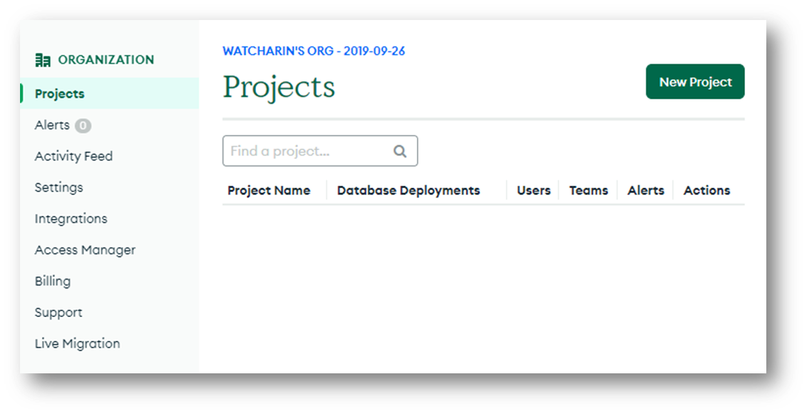 
       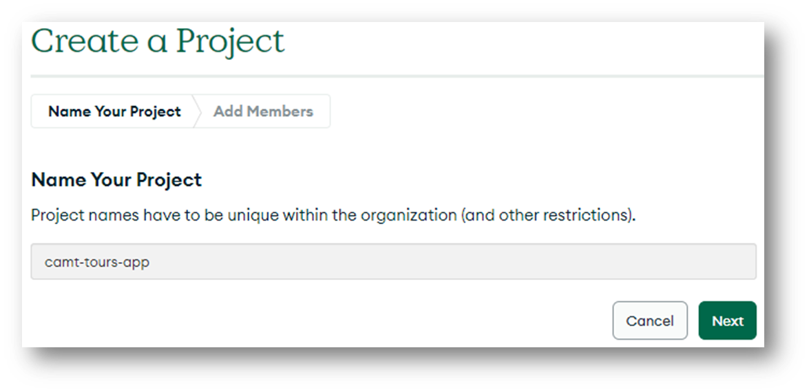 
       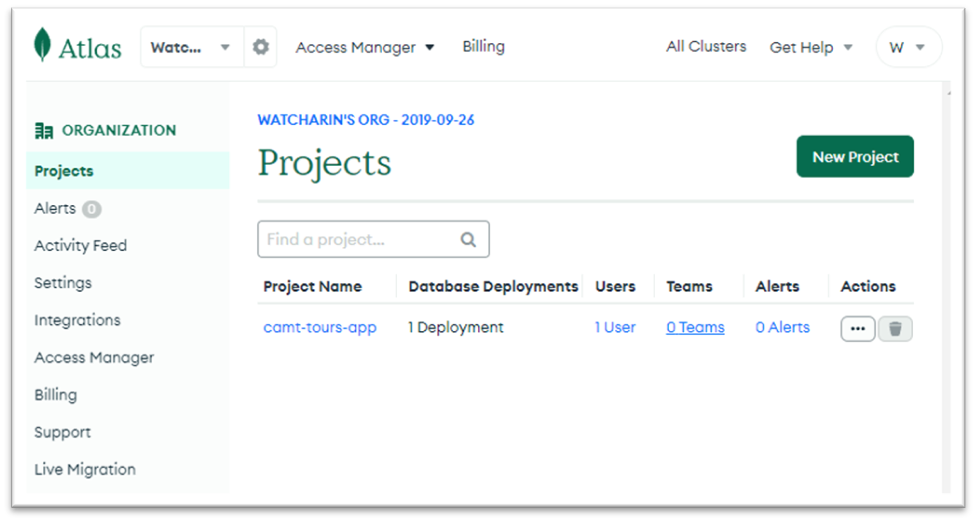  
     - Make sure you are a “`Project Owner` and then click `Create Project`
         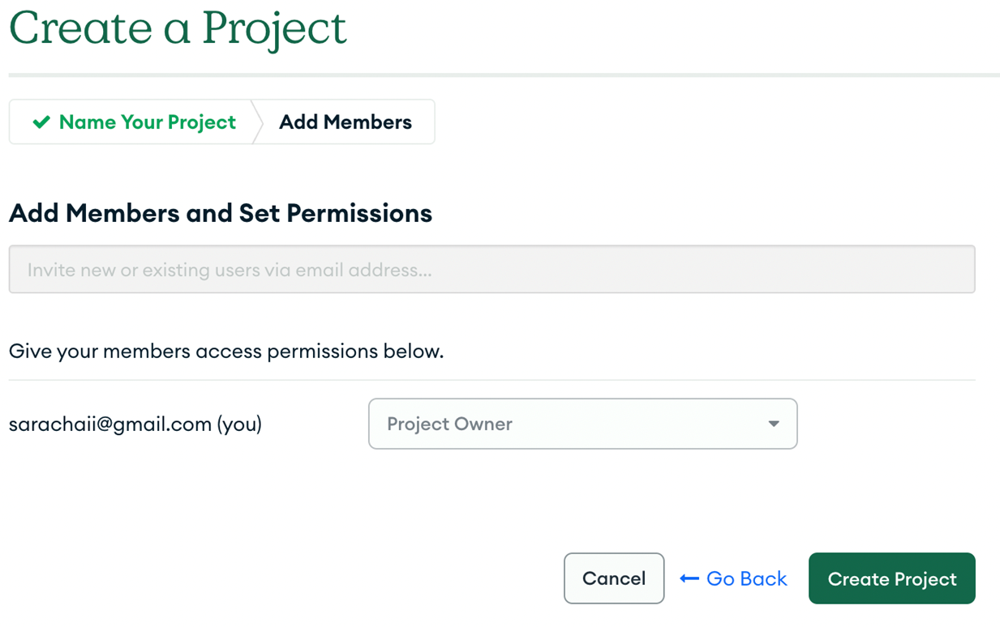  
     - Build a database by selecting a free plan and click `Create`
         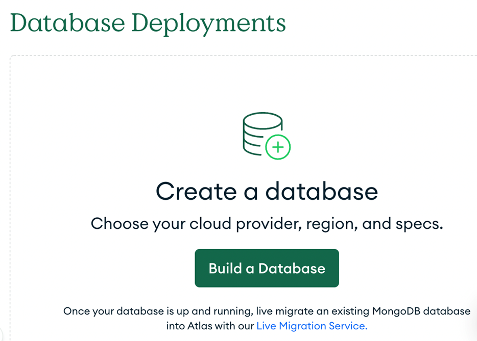
        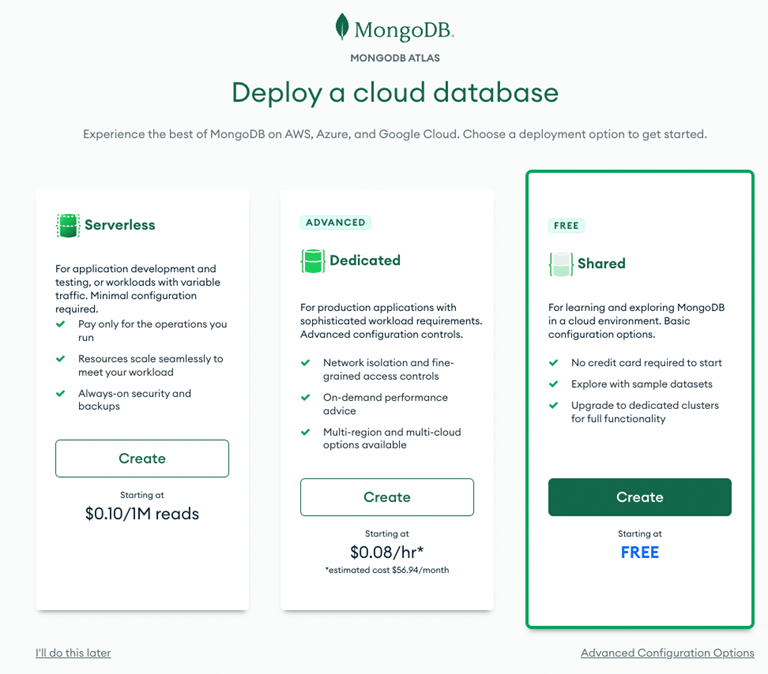  
     - Let’s all option is default and then click `Create Cluster`
         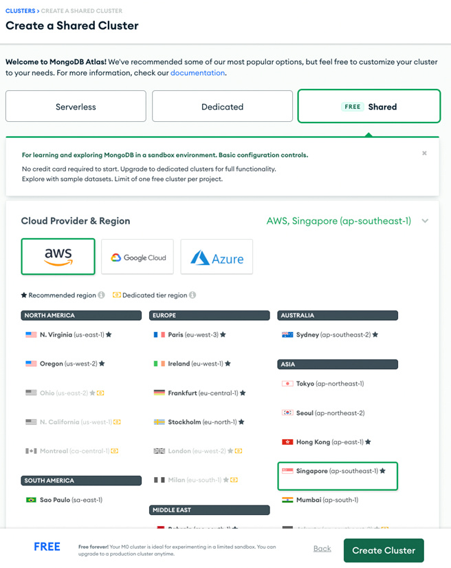  
     - For the Security choose `Username and Password`
         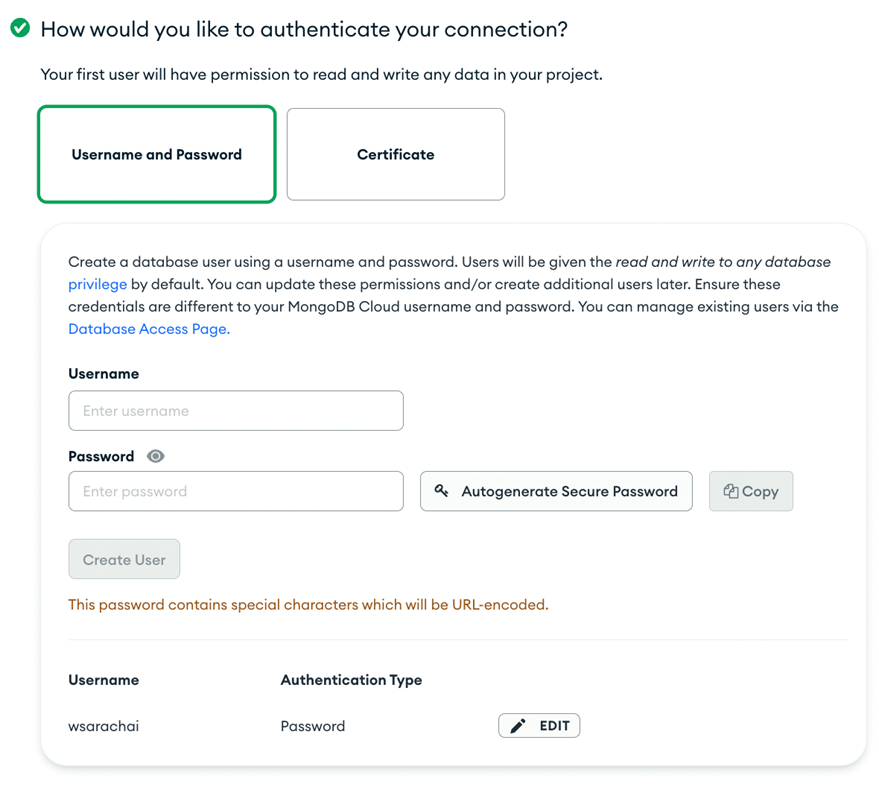  
       Save your password to text editor else for later use (For example, `notepad`)
     - Where would you like to connect from?
       - Select `My Local Environment`
       - Click `Add My Current IP Address`
       - Finally, click `Finish and Close`
           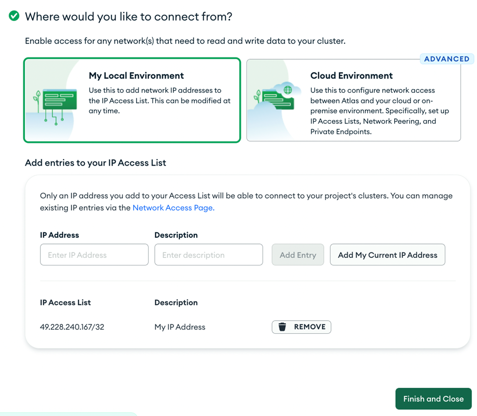  
     - We will use the Compass App to connect to this database
       - Click the `Connect` button
           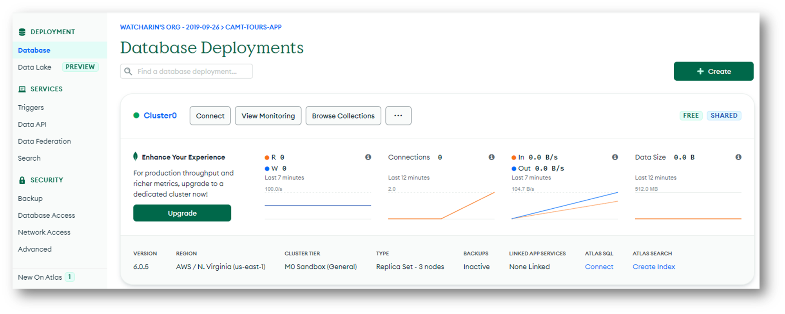  
       - Select `Compass` button
           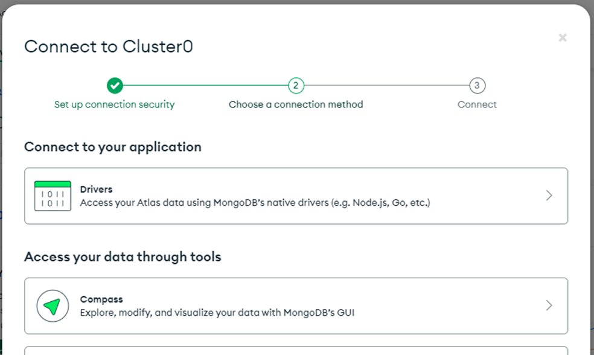  
       - Choose `I have MongoDB Compass` and copy the connection link. Save the connection link to text editor such as `notepad`
           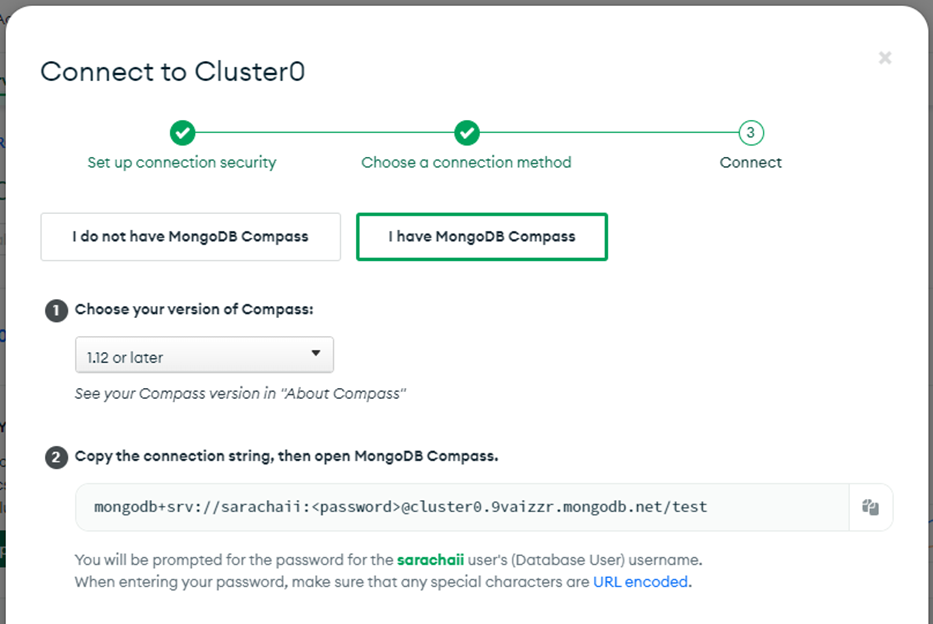  

2. MongoDB Compass installation

   - Goto [https://www.mongodb.com/products/compass](https://www.mongodb.com/products/compass)
   - Download and install the Compass App upon your operating system (Window, Mac), I recommend downloading the stable version.
   - Open the Compass App.

3. Use Compass to connect to the Hosting Database

   - Click `New connection` and paste the connection link you saved in the previous step
       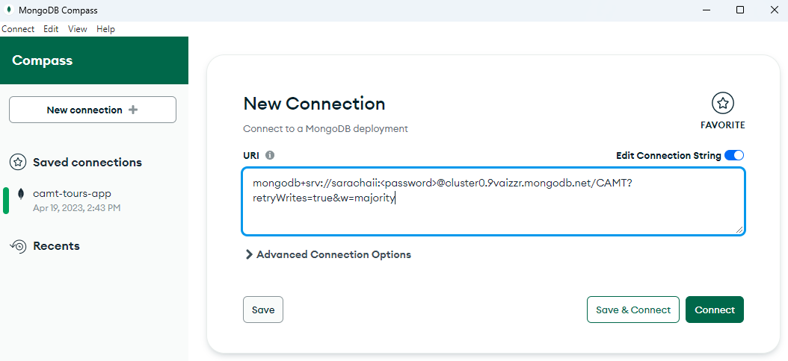  
   - Replace `<password>` with your password generated in the previous step and Click `Connect`
   - `Optional setting:` If you can't connect to the database, we need to allow the clients can access our database server from anywhere
     - Click `Network Access` then on the `IP Address' section, click `EDIT`
         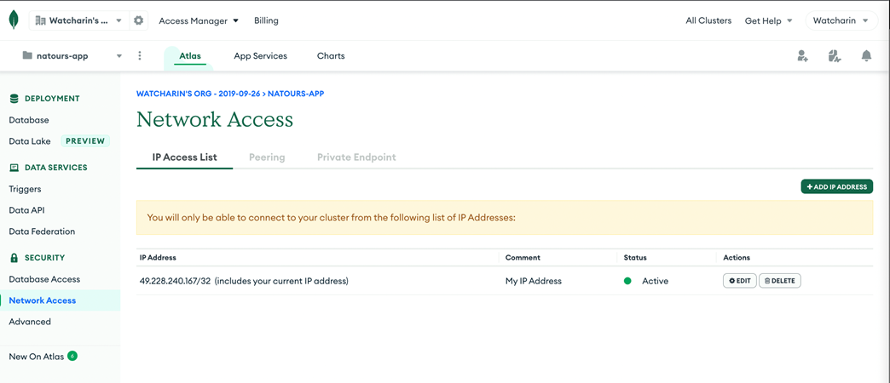  
     - Click `ALLOW ACCESS FROM ANYWHERE` then click `Confirm`
         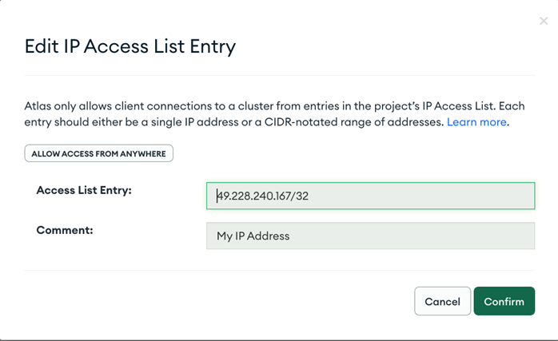  
   - If the connection is successful, there are two databases that already exist (`admin` and `local`)

4. Using Compass App for CRUD Operaations

   - Let's create a new database `CAMT` by clicking the plus symbol (+)
     - Give the Database Name => `CAMT`
     - Give the Collection Name => `tours`
     - Click `Create Database`
         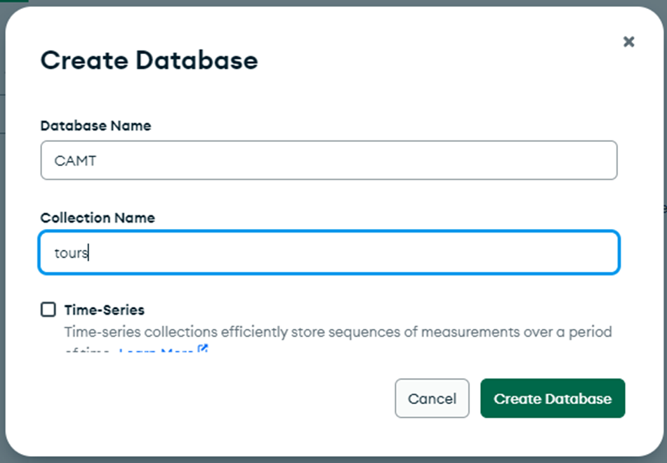  
     - Follow the steps in the picture below to create a new simple tour record
         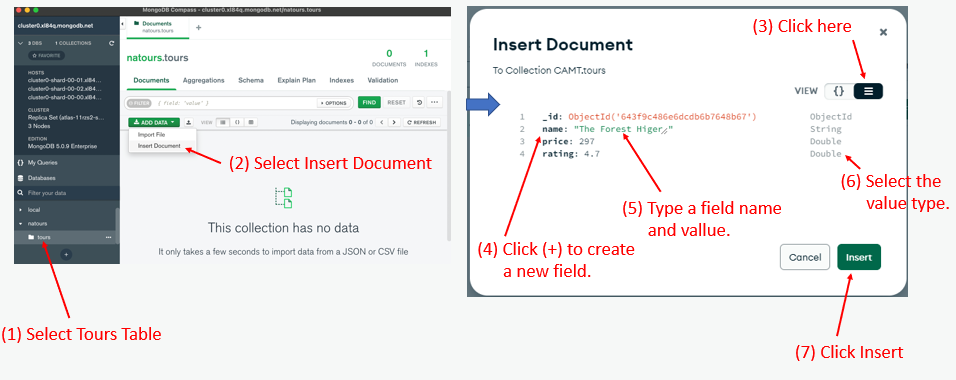  

5. Finish
